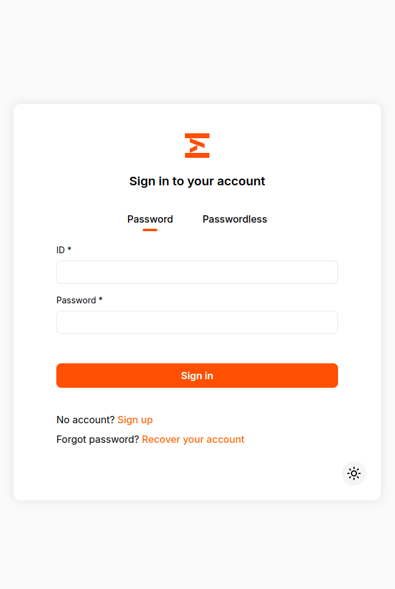
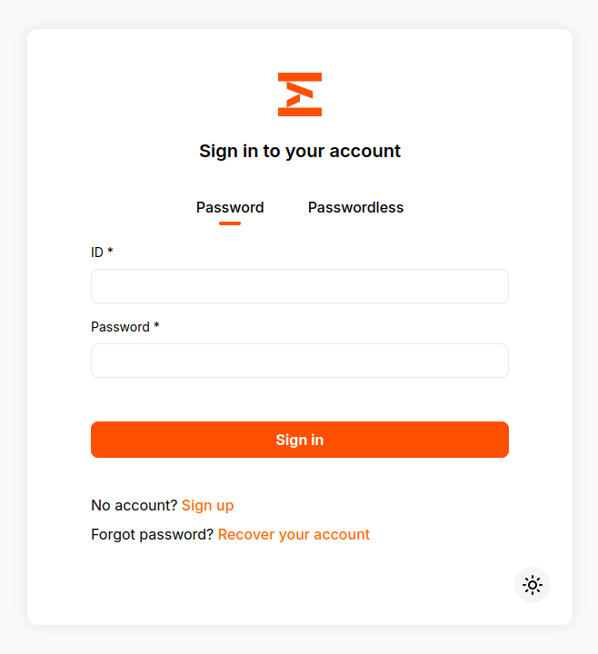
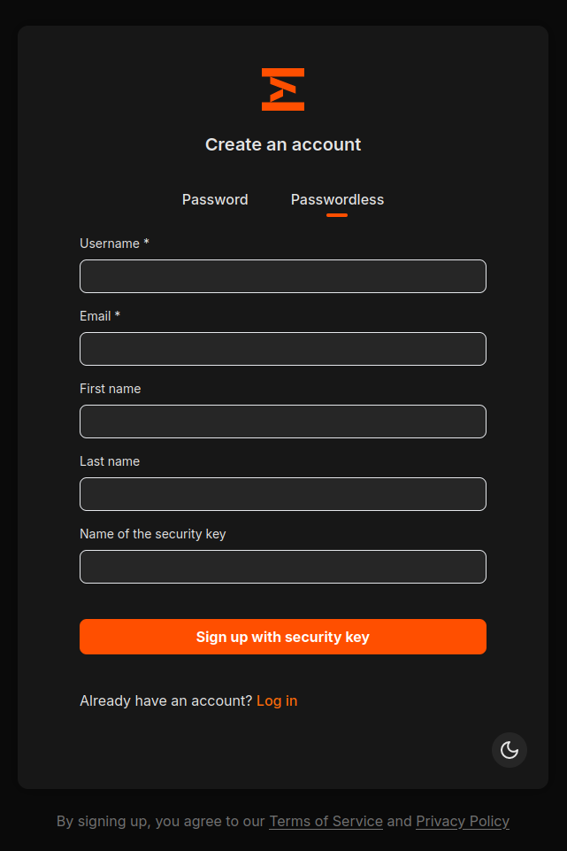
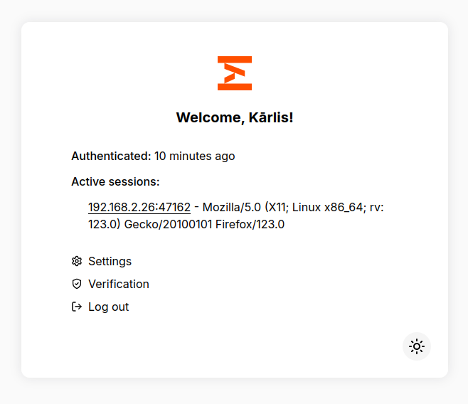
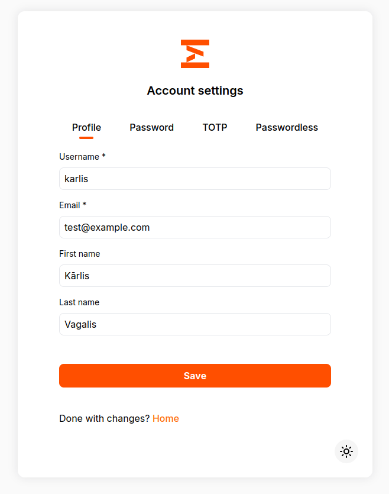
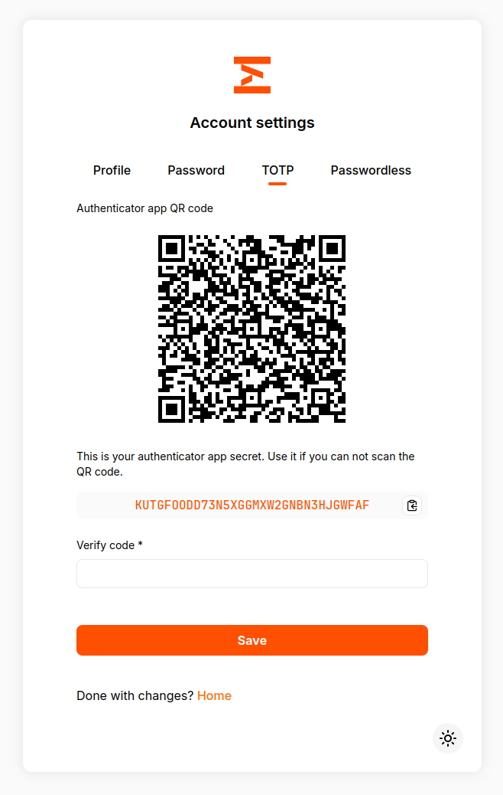

# Kratos Self-Service UI

This is a super fast and responsive self-service UI for open source user management system [Ory Kratos](https://github.com/ory/kratos) built in SvelteKit. The project uses [Melt UI](https://github.com/melt-ui/melt-ui) for creation of accessable and WAI-ARIA compliant components, and TailwindCSS for styling.



## Features

- Disabled flows from Kratos config are considered (e.g. not showing Sign Up option, if Kratos config has that flow disabled)
- Mobile support
- Dark mode
- All flows supported: login, logout, signup, recovery, verification, settings
- Tested self-service methods: password, webauthn, code, totp
- Error, success and info messages

### Not supported (at least yet)

- Languages other than English

## Customization

### Logo

This can be set at `static/favicon.svg` for browser tab icon, and `src/lib/Logo.svelte` for main logo shown above forms.

## Environment variables

```bash
# Publicly available Kratos instance URL, without trailing slash
PUBLIC_KRATOS=http://localhost:4433

# Name of the organization/instance, used for page titles
PUBLIC_ORGANIZATION=My Org
# Links to the Terms of Service and Privacy Policy, used for registration page
PUBLIC_TERMS_OF_SERVICE=http://localhost/terms-of-service
PUBLIC_PRIVACY_POLICY=http://localhost/privacy-policy
```

## Docker

You can use available Dockerfile to build containerized version of the self-service yourself.

There is also prebuilt image available at [Docker Hub](https://hub.docker.com/r/karlisvagalis/kratos-selfservice) via `karlisvagalis/kratos-selfservice:latest` or [Github Docker Registry](https://github.com/karlis-vagalis/kratos-selfservice/pkgs/container/kratos-selfservice) via `ghcr.io/karlis-vagalis/kratos-selfservice:latest`.

### Environment variables

`PUBLIC_KRATOS` - Publicly available Kratos instance URL, without trailing slash
 
`PUBLIC_ORGANIZATION` - Name of the organization/instance, used for page titles

`PUBLIC_TERMS_OF_SERVICE` - Link to the Terms of Service

`PUBLIC_PRIVACY_POLICY` - Link to the Privacy Policy

## Screenshots






